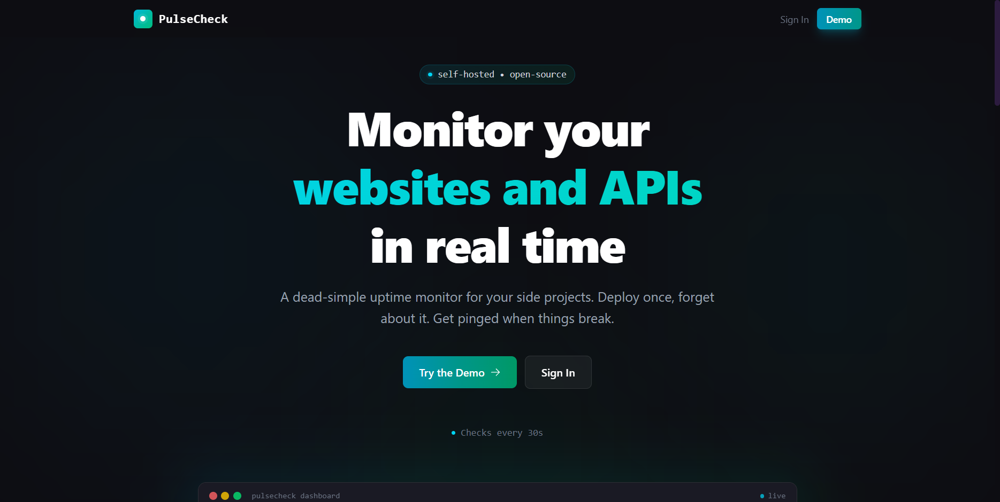

# PulseCheck

> A monitoring system designed to help developers and small teams detect downtime and performance issues in real time.

---

## Overview

PulseCheck is a monitoring system designed to help developers and small teams detect downtime and performance issues in real time.

### Goals

- **Reduce blind spots** - Continuous automated health checks for all your services
- **Shorten downtime response time** - Fast incident detection and alerting
- **Provide clear service health visibility** - Centralized monitoring dashboard with historical insights

---

## Architecture

PulseCheck follows a **SPA + API architecture**:

- **Frontend:** Vue 3 SPA with Vue Router
- **Backend:** Laravel 11 REST API

---

## Tech Stack

| Category          | Technology                           |
| ----------------- | ------------------------------------ |
| Backend Framework | Laravel 11 (API-only)                |
| Frontend          | Vue.js 3 + Vue Router + Tailwind CSS |
| Database          | PostgreSQL (AWS RDS)                 |
| Queue System      | Redis                                |
| Background Jobs   | Laravel Queue Workers                |
| Scheduling        | Laravel Scheduler (cron)             |
| Email Alerts      | AWS SES                              |
| Deployment        | AWS EC2 + RDS (Free Tier)            |
| Containerization  | Docker + Docker Compose              |

## License

The Laravel framework is open-sourced software licensed under the [MIT license](https://opensource.org/licenses/MIT).
