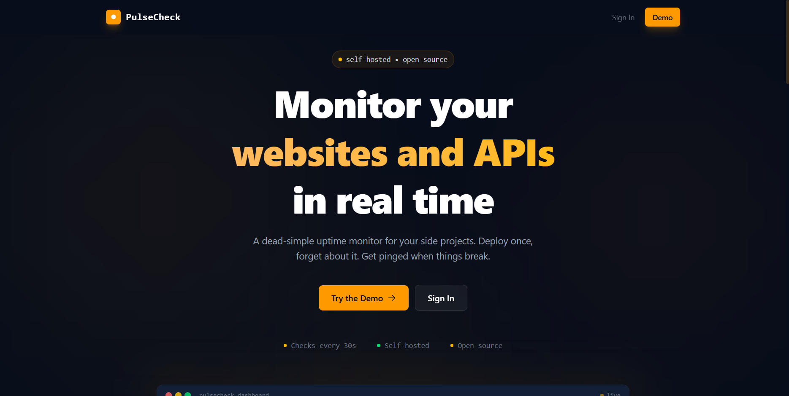
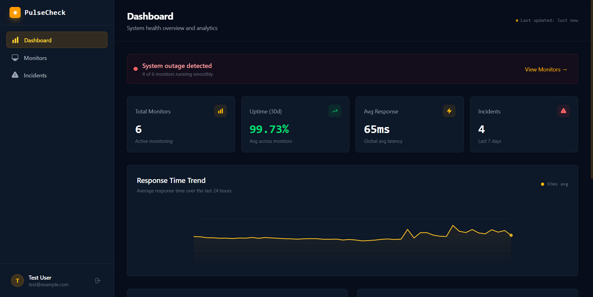
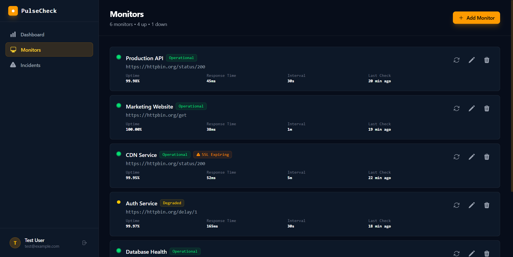

# PulseCheck

> Real-time uptime monitoring and incident management for developers and small teams.

---

## Live Demo

**[https://getpulsecheck.tech](https://getpulsecheck.tech/)**

Use the credentials below to explore the full dashboard — no sign-up required:

| Field    | Value              |
| -------- | ------------------ |
| Email    | `test@example.com` |
| Password | `password`         |

> The demo environment resets daily. Feel free to create monitors and explore all features.

---

## Screenshots

| Landing Page                                  | Dashboard                                    | Monitor Detail                                  |
| --------------------------------------------- | -------------------------------------------- | ----------------------------------------------- |
|  |  |  |

> **To add screenshots:** run the app locally, take screenshots, and place them in `docs/screenshots/`.

---

## Overview

PulseCheck is a self-hosted uptime monitoring platform that continuously checks the health of your web services and APIs. When a service goes down or responds too slowly, PulseCheck detects the issue, opens an incident, and notifies you by email — so you can respond before users start complaining.

Built for developers who want reliable visibility without enterprise-grade overhead or monthly SaaS bills.

---

## Key Features

- **Automated health checks** — HTTP/HTTPS monitors with configurable intervals (30s to 24h) and custom status code thresholds
- **Incident management** — Automatic incident creation, timeline updates, and resolution tracking
- **Real-time dashboard** — Live service status with uptime percentages and 24h response time charts
- **Email alerts** — Instant notifications when monitors go down and when they recover
- **SSL monitoring** — Tracks certificate expiry and warns 30 days in advance
- **Historical analytics** — 30-day uptime history and per-check logs for root-cause analysis
- **Self-hosted** — Your data never leaves your server. Docker-ready for one-command deploys

---

## Architecture

PulseCheck follows a **decoupled SPA + REST API** architecture:

- **Frontend:** Vue 3 SPA with Vue Router, Pinia state management, and Tailwind CSS v4
- **Backend:** Laravel 13 API-only application with Sanctum token authentication
- **Background workers:** Laravel Queue processes health checks asynchronously
- **Scheduler:** Laravel Cron dispatches monitor jobs on configurable intervals

---

## Tech Stack

| Category          | Technology                                |
| ----------------- | ----------------------------------------- |
| Backend Framework | Laravel 13 (API-only)                     |
| Frontend          | Vue.js 3 (Composition API) + Vue Router 4 |
| State Management  | Pinia                                     |
| Styling           | Tailwind CSS v4 + Vite                    |
| Database          | PostgreSQL 16                             |
| Background Jobs   | Laravel Queue Workers                     |
| Scheduling        | Laravel Scheduler (cron)                  |
| Email Alerts      | SMTP (Gmail, Mailgun, etc.)               |
| Containerization  | Docker + Docker Compose                   |

---

## Getting Started

### Prerequisites

- PHP 8.3+
- Composer
- Node.js 20+
- PostgreSQL 16

### Local Setup

```bash
# 1. Clone the repository
git clone https://github.com/your-username/pulsecheck.git
cd pulsecheck

# 2. Install dependencies
composer install
npm install

# 3. Configure environment
cp .env.example .env
php artisan key:generate

# 4. Set up your database (edit .env first — see Environment Variables below)
php artisan migrate --seed

# 5. Start all development processes
npm run dev &
php artisan serve &
php artisan queue:work &
php artisan schedule:work
```

Open [http://localhost:8000](http://localhost:8000) and log in with `test@example.com` / `password`.

### Docker (recommended)

```bash
cp .env.example .env
# Edit .env and set MAIL_* variables for email alerts
docker compose up --build -d
docker compose exec app php artisan migrate --seed
```

Open [http://localhost](http://localhost).

---

## Environment Variables

Copy `.env.example` to `.env` and configure:

```env
# Application
APP_NAME=PulseCheck
APP_URL=http://localhost

# Database — must match docker-compose.yml if using Docker
DB_CONNECTION=pgsql
DB_HOST=127.0.0.1
DB_PORT=5432
DB_DATABASE=pulsecheck
DB_USERNAME=postgres
DB_PASSWORD=your_password

# Queue driver — use "database" for simple setups, "redis" for production
QUEUE_CONNECTION=database

# Email alerts — required for up/down notifications
MAIL_MAILER=smtp
MAIL_HOST=smtp.gmail.com
MAIL_PORT=465
MAIL_USERNAME=your-email@gmail.com
MAIL_PASSWORD=your-gmail-app-password
MAIL_FROM_ADDRESS=your-email@gmail.com
MAIL_SCHEME=ssl

# Frontend API base URL — leave empty when frontend and backend share origin
VITE_API_URL=
```

---

## API Overview

All endpoints require `Authorization: Bearer <token>` except `/api/signin` and `/api/register`.

| Method | Endpoint                   | Description                   |
| ------ | -------------------------- | ----------------------------- |
| POST   | `/api/register`            | Create account                |
| POST   | `/api/signin`              | Authenticate and get token    |
| POST   | `/api/signout`             | Revoke current token          |
| GET    | `/api/dashboard/stats`     | Aggregated system health      |
| GET    | `/api/monitors`            | List all monitors             |
| POST   | `/api/monitors`            | Create a new monitor          |
| GET    | `/api/monitors/{id}`       | Monitor detail + history      |
| PUT    | `/api/monitors/{id}`       | Update monitor settings       |
| DELETE | `/api/monitors/{id}`       | Delete monitor                |
| POST   | `/api/monitors/{id}/check` | Run an instant health check   |
| GET    | `/api/incidents`           | List incidents (filterable)   |
| GET    | `/api/incidents/{id}`      | Incident detail with timeline |

---

## License

This project is open-sourced software licensed under the [MIT License](https://opensource.org/licenses/MIT).
