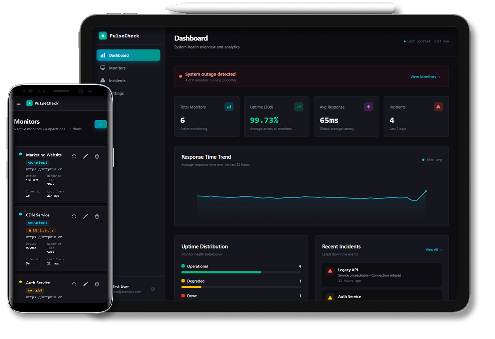

# PulseCheck

> Real-time uptime monitoring and incident management for developers and small teams.



---

## Live Demo

**[https://your-demo-url.com](https://your-demo-url.com)**

| Field    | Value              |
| -------- | ------------------ |
| Email    | `test@example.com` |
| Password | `password`         |

> The demo environment resets periodically. Feel free to create monitors and explore all features.

---

## Overview

PulseCheck is a full-stack uptime monitoring platform that continuously checks the health of your web services and APIs. When a service goes down or responds too slowly, PulseCheck detects the issue immediately, opens an incident, and notifies your team — so you can respond before users start complaining.

Built for developers who need reliable visibility without the overhead of enterprise-grade tooling.

---

## Key Features

- **Automated health checks** — Configurable HTTP monitors with custom intervals and thresholds
- **Incident management** — Automatic incident creation, updates, and resolution tracking
- **Real-time dashboard** — Live service status with uptime percentages and response time history
- **Email alerts** — Instant notifications when monitors go down or recover
- **Historical insights** — Monitor check logs and incident timelines for root-cause analysis
- **Team-ready** — Multi-user support with authentication and role-based access

---

## Architecture

PulseCheck follows a **decoupled SPA + REST API** architecture:

- **Frontend:** Vue 3 single-page application with Vue Router and Tailwind CSS
- **Backend:** Laravel 11 API-only application handling business logic, scheduling, and queue processing
- **Background workers:** Laravel Queue processes health checks asynchronously to prevent blocking
- **Scheduler:** Laravel Cron dispatches monitor jobs on configurable intervals

---

## Tech Stack

| Category          | Technology                           |
| ----------------- | ------------------------------------ |
| Backend Framework | Laravel 11 (API-only)                |
| Frontend          | Vue.js 3 + Vue Router + Tailwind CSS |
| Database          | PostgreSQL                           |
| Background Jobs   | Laravel Queue Workers                |
| Scheduling        | Laravel Scheduler (cron)             |
| Email Alerts      | SMTP                                 |
| Containerization  | Docker + Docker Compose              |

---

## Getting Started

### Prerequisites

- PHP 8.2+
- Composer
- Node.js 18+
- PostgreSQL

### Local Setup

```bash
# Clone the repository
git clone https://github.com/your-username/pulsecheck.git
cd pulsecheck

# Install PHP dependencies
composer install

# Install JS dependencies
npm install

# Copy environment file and configure your variables
cp .env.example .env
php artisan key:generate

# Run migrations and seeders
php artisan migrate --seed

# Start the development servers
npm run dev
php artisan serve
php artisan queue:work
php artisan schedule:work
```

### Docker

```bash
docker compose up --build
docker compose exec app php artisan migrate --seed
```

---

## License

This project is open-sourced software licensed under the [MIT License](https://opensource.org/licenses/MIT).
